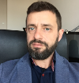
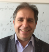
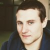

### Head

  
  
Piotr Zielenkiewicz, PhD, prof.

### Staff

##### Omics data analysis and visualization

  
  <ul>
    <li>
<a href="http://webjeda.com/online-cv/">Agnieszka Gromadka, MSc</a>
</li>
    <li>
agromadka@ibb.waw.pl
</li>
    <li>
+48 22 592 5758
</li>
  </ul>

### Principal investigators

##### Cheminformatics, structural biology, systems medicine

  
  <ul>
    <li>
<a href="https://scholar.google.pl/citations?hl=en&user=4MGHwSYAAAAJ">Pawel Siedlecki, PhD</a>
</li>
    <li>
pawel@ibb.waw.pl
</li>
    <li>
+48 22 592 5761
</li>
  </ul>

##### Apoptosis, evolutionary bioinformatics

  
  <ul>
    <li>
<a href="https://www.researchgate.net/profile/Szymon_Kaczanowski">Szymon Kaczanowski, PhD</a>
</li>
    <li>
szymon@ibb.waw.pl
</li>
    <li>
+48 22 592 5763
</li>
  </ul>

##### Computational Chemistry, Organic Photovoltaics & Photochemistry

  
  <ul>
    <li>
<a href="https://scholar.google.pl/citations?user=BKDfA3sAAAAJ&hl=en">Dorota Niedziałek, PhD</a>
</li>
    <li>
FIXME@ibb.waw.pl
</li>
    <li>
+48 22 592 5760
</li>
  </ul>

##### Reaction kinetics, Membrane biophysics, Systems biology

  
  <ul>
    <li>
<a href="https://scholar.google.pl/citations?user=CvnQtdcAAAAJ&hl=en">Piotr Pawłowski, PhD</a>
</li>
    <li>
piotrp@ibb.waw.pl
</li>
    <li>
+48 22 592 5760
</li>
  </ul>

### PhD Students:

  
  <ul>
    <li>
<a href="http://webjeda.com/online-cv/">Norbert Odolczyk, MSc</a>
</li>
    <li>
nodolczyk@ibb.waw.pl
</li>
    <li>
+48 22 592 5758
</li>
  </ul>

  
  <ul>
    <li>
<a href="http://webjeda.com/online-cv/">Marta Stępniewska-Dziubińska, MSc</a>
</li>
    <li>
FIXME@ibb.waw.pl
</li>
    <li>
+48 22 592 5758
</li>
  </ul>

  
  <ul>
    <li>
<a href="http://webjeda.com/online-cv/">Małgorzata Habich, MSc</a>
</li>
    <li>
malgorzata.habich@gmail.com
</li>
    <li>
+48 22 592 5758
</li>
  </ul>

  
  <ul>
    <li>
<a href="https://dizak.github.io/online-cv/">Dariusz Izak, MSc</a>
</li>
    <li>
dariusz.izak@ibb.waw.pl
</li>
    <li>
+48 22 592 5758
</li>
  </ul>

  
  <ul>
    <li>
<a href="http://webjeda.com/online-cv/">Rafał Jastrząb, MSc</a>
</li>
    <li>
jastrzab.rafal@gmail.com
</li>
    <li>
+48 22 592 5758
</li>
  </ul>

### Students:

  - Maksymilian Mrozowski
  - Jakub Poziemski
  - Alicja Nowakowska
  - Michał Grosztyła

### Alumni:

  - Maciej Wójcikowski PhD, currently at Merck

  - Anna Łukasik PhD, AstraZeneca

  - Arkadiusz Gładki PhD, Roche

  - Albert Bogdanowicz MSc,  Novartis

  - Marlena Siwiak PhD, HARNESS Property Intelligence Ltd

  - Marian Siwiak PhD, Sony Mobile Communications

  - prof. Andrzej Kierzek, Certara

  - Jerzy Dyczkowski PhD, Roche

  - Danuta Płochocka PhD, (emeritus)
